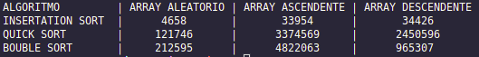

# Forum avaliativo

## Introdução 

Como proposto no fórum avaliativo da disciplina de estruturas de dados, foi implementado neste projeto um teste para verificar qual a eficiência dos algoritmos de ordenação: 

- Bouble Sort 
- Insertation Sort
- Quick Sort

## Implementação

Foram feitas implementações dos três algoritmos na linguagem Java seguindo o que se tem já produzido a respeito destes três algoritmos.

Para a realização dos testes foi desenvolvida uma classe capaz de gerar Arrays de tamanhos específicos com numeros aleatórios sendo que estes arrays gerados podem ser com disposição dos números aleatoriamente, podem ser ordenados de maneira ascendente ou descendente.

O ponto de execução do projeto é a classe `./src/App.java` onde são feitos os testes e é exibido o resultado.

## Conclusão
De acordo com a imagem a seguir do teste feito com Arrays de comprimento igual a 1000, sendo que os valores apresentados são os intervalos em nano segundos gastos pelos algoritmos para ordenar os arrays, podemos concluir que o algoritmo com maior eficiência é o Insertation Sort, seguido pelo Quick Sort e por fim o Bouble Sort.

