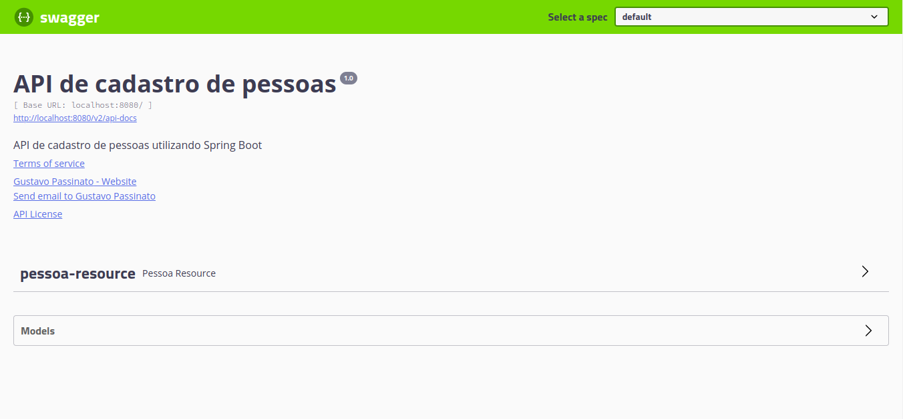
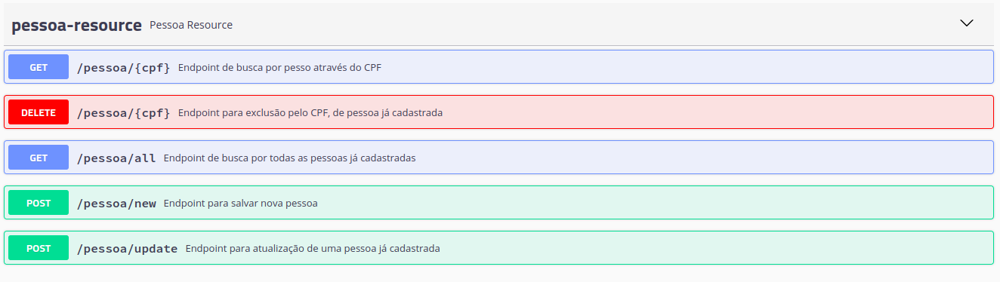
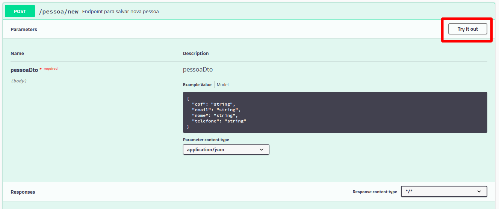
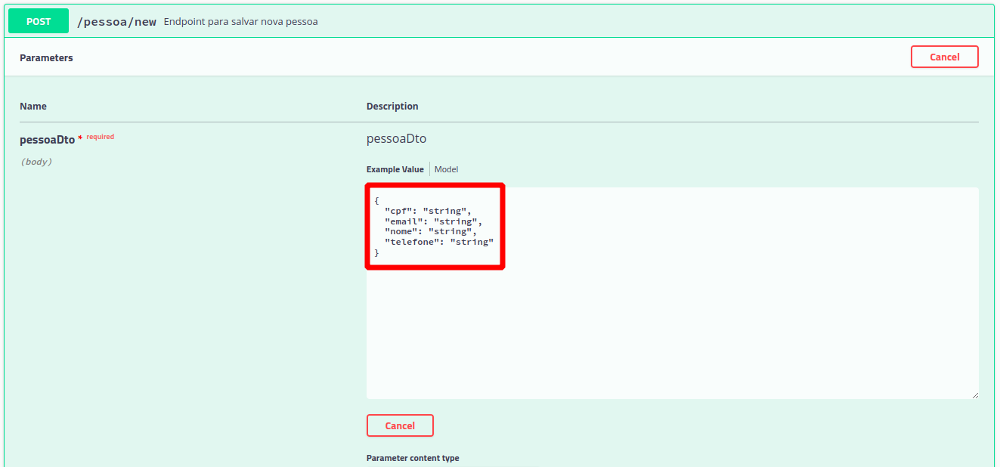
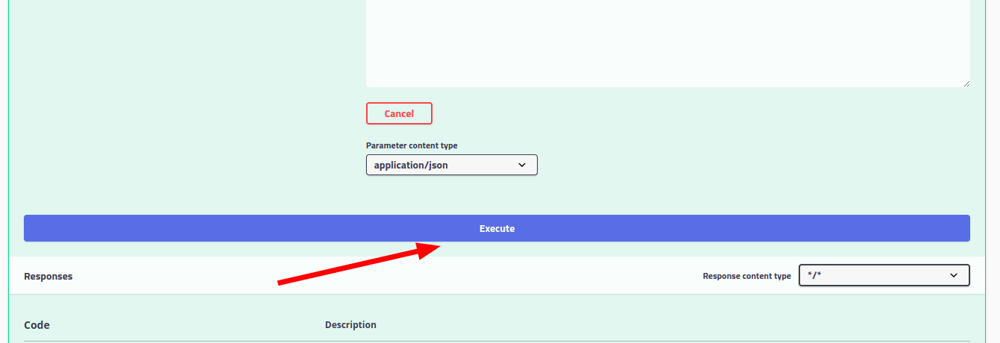
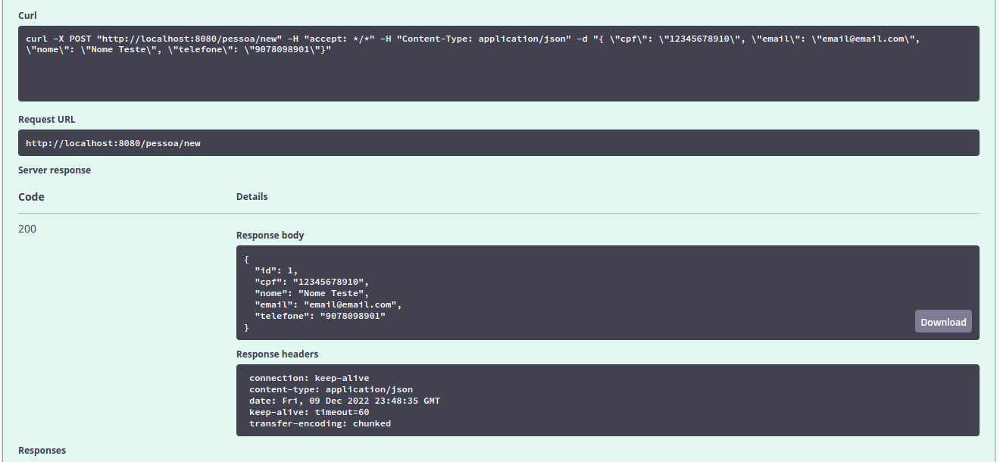

# Fórum avaliativo

Como proposta de solução para o fórum avaliativo da disciplina de Programação Orientada a Objetos com Banco de Dados, foi desenvolvida uma aplicação baseada em Java utilizando o framework [Spring Boot](https://spring.io/projects/spring-boot) em uma construção de API básica possibilitando assim realizar todas as instruções desejadas. Além disso, para facilitar o uso em outros dispositivos foi optado pelo banco de dados em memória [H2](https://www.h2database.com/html/main.html), e também foi utilizado para documentação dos endpoints o [Swagger](https://swagger.io/).

## Utilização local do projeto

### Download
Primeiro realize o download dos arquivos: [aqui](https://minhaskamal.github.io/DownGit/#/home?url=https://github.com/gustavopassinato/grad-projects/tree/main/poo_com_banco_de_dados/forum)

### Buid 
Com os arquivos baixados e estando dentro do diretório do projeto, realize o build do projeto com o seguinte comando: 

```
mvn package 
```
### Execução
Para executar o projeto utilize o comando:

```
java -jar target/forum-0.0.1-SNAPSHOT.jar
```
Depois disso, basta acessar a URL: 

```
http://localhost:8080/swagger-ui.html
```
E então será aberta a página inical do projeto listando todos os endpoints disponíveis:



### Uso da API

Dentro do menu "pessoas-resource" temos os endpoints disponiveis: 



O uso do endpoint esta condicionado aos parâmetros que ele necessita para enviar a requisição, como por exemplo para criar uma nova pessoa, utilizamos `/pessoa/new`



Clicando no botão indicado será exibida a seção para inserção dos valores desejados para cada campo da requisição:



Feito o preenchimento basta clicar em: 



E logo abaixo é possível visualizar o resumo da sua requisição:


